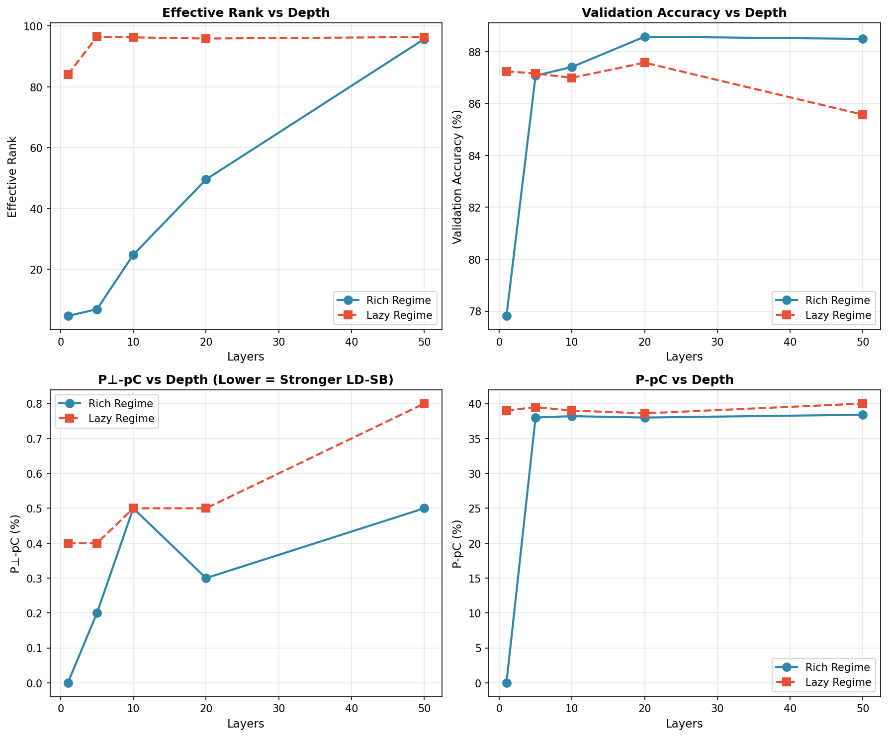

# Low-Dimensional Simplicity Bias (LD-SB) Reproduction

This repository contains a partial reproduction of the Low-Dimensional Simplicity Bias (LD-SB) experiments from the NeurIPS 2023 paper *"Neural Networks Learn Low-Dimensional Simplicity Bias"*. We implement the core LD-SB evaluation framework and OrthoP methodology, then extend the experiments to investigate how network depth affects simplicity bias.

---

## Implemented Components

### 1. LD-SB Evaluation (`ldsb_eval.py`)

We implement the LD-SB metric computation as described in the paper:

- **Projection Matrix P**: Computed via SVD of the first-layer weight matrix, projecting onto the top-k singular vectors where k is determined by the effective rank
- **P⊥-pC (Prediction Change in orthogonal subspace)**: Measures how often predictions change when replacing the P-component with features from a different sample. Lower values indicate stronger reliance on the low-dimensional subspace P
- **P-pC (Prediction Change in P subspace)**: Measures how often predictions differ from a sample that only contributes the orthogonal component. Higher values indicate predictions primarily depend on features within P

### 2. OrthoP Framework (`ldsb/orthop.py`)

We implement the OrthoP experimental setup comparing Rich vs Lazy training regimes:

- **Rich Regime**: First-layer weights initialized uniformly on the unit sphere, enabling significant feature learning and rank collapse
- **Lazy Regime**: NTK-style initialization with variance scaling by 1/√d, where weights stay close to initialization

### 3. Multi-Layer MLP Architecture (`model.py`)

We extend the original one-hidden-layer setup to support arbitrary depth, enabling our investigation of depth effects on simplicity bias.

---

## Hypothesis: Effect of Network Depth on LD-SB

**Our hypothesis**: Increasing network depth will affect the strength of low-dimensional simplicity bias. Specifically, we investigate whether deeper networks exhibit different effective rank dynamics and LD-SB characteristics compared to shallow networks.

We train MLPs with varying depths (1, 5, 10, 20, 50 layers) on the Waterbirds dataset using pre-extracted ResNet-50 features, comparing both Rich and Lazy training regimes.

---

## Experimental Results

All experiments use:
- **Dataset**: Waterbirds (binary classification: landbird vs waterbird)
- **Features**: 2048-dim ResNet-50 pretrained features
- **Hidden dim**: 100
- **Training**: 20,000 steps with warmup + cosine decay
- **Seed**: 42 (for reproducibility)

### Rich vs Lazy Regime Comparison

| Layers | Regime | Val Acc (%) | Eff. Rank | P⊥-pC (%) | P-pC (%) |
|--------|--------|-------------|-----------|-----------|----------|
| 1      | Rich   | 77.81       | 4.68      | 0.0       | 0.0      |
| 1      | Lazy   | 87.24       | 84.03     | 0.4       | 39.0     |
| 5      | Rich   | 87.07       | 6.90      | 0.2       | 38.0     |
| 5      | Lazy   | 87.16       | 96.50     | 0.4       | 39.5     |
| 10     | Rich   | 87.41       | 24.81     | 0.5       | 38.2     |
| 10     | Lazy   | 86.99       | 96.28     | 0.5       | 39.0     |
| 20     | Rich   | 88.57       | 49.57     | 0.3       | 38.0     |
| 20     | Lazy   | 87.57       | 95.89     | 0.5       | 38.6     |
| 50     | Rich   | 88.49       | 95.74     | 0.5       | 38.4     |
| 50     | Lazy   | 85.57       | 96.39     | 0.8       | 40.0     |

### Visualization



### Key Findings

1. **Rank Collapse is Regime-Dependent**  
   In the rich regime, effective rank varies dramatically with depth (4.68 → 95.74), while in the lazy regime it remains nearly constant (~96) regardless of depth.

2. **Depth Modulates Rank Collapse Only in Rich Regime**  
   The monotonic increase in effective rank with depth occurs specifically because feature learning in the rich regime causes weight updates. In the lazy regime, weights barely move from initialization, so depth has no effect on rank.

3. **LD-SB Metrics Converge Across Regimes at Sufficient Depth**  
   For 50-layer networks, both regimes achieve similar effective ranks (~96) and similar LD-SB metrics (P-pC ~38-40%), suggesting that deep rich-regime networks eventually approximate lazy-regime behavior.

4. **1-Layer Rich Regime Shows Extreme LD-SB**  
   The 1-layer rich model exhibits P-pC = 0.0%, indicating it relies exclusively on the low-dimensional subspace. This is the most extreme form of simplicity bias observed.

---

## File Structure

```
├── config.py          # Hyperparameters and configuration
├── data.py            # Waterbirds dataset loading and feature extraction
├── model.py           # Multi-layer MLP with Rich/Lazy initialization
├── train.py           # Training loop with warmup + cosine schedule
├── trainer.py         # Training utilities
├── ldsb_eval.py       # LD-SB metric computation
├── main.py            # Main entry point for experiments
├── utils.py           # Utility functions (set_seed, compute_effective_rank)
├── plot_results.py    # Generate Rich vs Lazy comparison plots
├── download_dataset.py # Download Waterbirds dataset
├── requirements.txt   # Python dependencies
├── ldsb/
│   ├── ldsb.py        # LD-SB reproduction script (Imagenette)
│   └── orthop.py      # OrthoP comparison (Imagenette)
├── outputs/
│   ├── results_rich_layer*.json   # Rich regime experiment results
│   └── results_lazy_layer*.json   # Lazy regime experiment results
└── results/
    ├── plot_rich_vs_lazy.png      # Main comparison figure
    ├── plot_rank_comparison_bar.png
    ├── plot_rank_over_time.png
    └── plot_all_metrics.png
```

---

## Installation

### Create Conda Environment

```bash
conda create -n ldsb python=3.10 -y
conda activate ldsb
pip install -r requirements.txt
```

### Download Dataset

```bash
python download_dataset.py
```

If SSL errors occur, manually download from the Waterbirds source and extract to `data/waterbirds_v1.0/`.

---

## Usage

### Run Single Experiment

```bash
# Rich regime (default)
python main.py --layers 1 --lr 1.0

# Lazy regime
python main.py --regime lazy --layers 5

# Custom learning rate
python main.py --regime rich --layers 10 --lr 0.1
```

### Run All Experiments

```bash
# Rich regime (all depths)
python main.py --regime rich --layers 1
python main.py --regime rich --layers 5
python main.py --regime rich --layers 10
python main.py --regime rich --layers 20
python main.py --regime rich --layers 50

# Lazy regime (all depths)
python main.py --regime lazy --layers 1
python main.py --regime lazy --layers 5
python main.py --regime lazy --layers 10
python main.py --regime lazy --layers 20
python main.py --regime lazy --layers 50
```

### Generate Plots

```bash
python plot_results.py
```

This generates:
- `results/plot_rich_vs_lazy.png` - 2x2 comparison grid
- `results/plot_rank_comparison_bar.png` - Bar chart of effective ranks
- `results/plot_rank_over_time.png` - Training dynamics

---

## CLI Arguments

| Argument | Type | Default | Description |
|----------|------|---------|-------------|
| `--layers` | int | 1 | Number of hidden layers |
| `--regime` | str | "rich" | Training regime: "rich" or "lazy" |
| `--lr` | float | None | Learning rate (uses config default if not set) |
| `--steps` | int | None | Number of training steps |

---

## Discussion

Our experiments reveal that the depth effect on LD-SB is fundamentally tied to the training regime:

- **Rich regime**: Depth suppresses rank collapse. Shallow networks (1-5 layers) exhibit dramatic rank collapse (from ~97 to 4-8), while deeper networks maintain higher effective rank. The 50-layer network barely reduces rank at all (97.6 → 95.74).

- **Lazy regime**: Depth has no effect on rank. The effective rank remains ~96 regardless of network depth, because weights stay close to their initialization.

This demonstrates that the depth-dependent suppression of rank collapse occurs specifically through gradient-based feature learning, not through architectural capacity alone.

---

## References

- Original Paper: *"Neural Networks Learn Low-Dimensional Simplicity Bias"* (NeurIPS 2023)
- Waterbirds Dataset: Sagawa et al., *"Distributionally Robust Neural Networks"*
