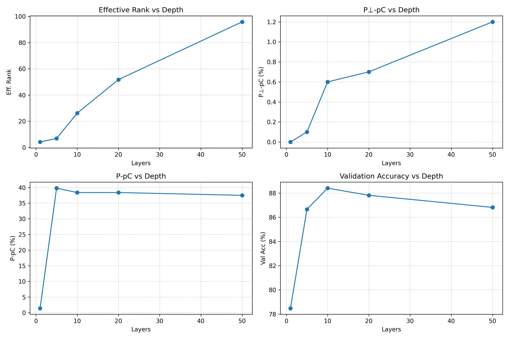

# Low-Dimensional Simplicity Bias (LD-SB) Reproduction

This repository contains a partial reproduction of the Low-Dimensional Simplicity Bias (LD-SB) experiments from the NeurIPS 2023 paper *"Neural Networks Learn Low-Dimensional Simplicity Bias"*. We implement the core LD-SB evaluation framework and OrthoP methodology, then extend the experiments to investigate how network depth affects simplicity bias.

---

## Implemented Components

### 1. LD-SB Evaluation (`ldsb_eval.py`)

We implement the LD-SB metric computation as described in the paper:

- **Projection Matrix P**: Computed via SVD of the first-layer weight matrix, projecting onto the top-k singular vectors where k is determined by the effective rank
- **P⊥-pC (Prediction Change in orthogonal subspace)**: Measures how often predictions change when replacing the P-component with features from a different sample. Lower values indicate stronger reliance on the low-dimensional subspace P
- **P-pC (Prediction Change in P subspace)**: Measures how often predictions differ from a sample that only contributes the orthogonal component. Higher values indicate predictions primarily depend on features within P

### 2. OrthoP Framework (`reproduce/orthop.py`)

We implement the OrthoP experimental setup comparing Rich vs Lazy training regimes:

- **Rich Regime**: First-layer weights initialized uniformly on the unit sphere, enabling significant feature learning and rank collapse
- **Lazy Regime**: NTK-style initialization with variance scaling by 1/√d, where weights stay close to initialization

### 3. Multi-Layer MLP Architecture (`model.py`)

We extend the original one-hidden-layer setup to support arbitrary depth, enabling our investigation of depth effects on simplicity bias.

---

## Hypothesis: Effect of Network Depth on LD-SB

**Our hypothesis**: Increasing network depth will affect the strength of low-dimensional simplicity bias. Specifically, we investigate whether deeper networks exhibit different effective rank dynamics and LD-SB characteristics compared to shallow networks.

We train MLPs with varying depths (1, 5, 10, 20, 50 layers) on the Waterbirds dataset using pre-extracted ResNet-50 features, all under the Rich training regime.

---

## Experimental Results

All experiments use:
- **Dataset**: Waterbirds (binary classification: landbird vs waterbird)
- **Features**: 2048-dim ResNet-50 pretrained features
- **Hidden dim**: 100
- **Training**: 20,000 steps with warmup + cosine decay
- **Regime**: Rich initialization

### Summary Table

| Layers | Learning Rate | Final Val Acc | Final Eff. Rank | P⊥-pC (↓) | P-pC (↑) | rank(P) |
|--------|---------------|---------------|-----------------|-----------|----------|---------|
| 1      | 1.0           | 78.48%        | 4.15            | 0.0%      | 1.4%     | 4       |
| 5      | 0.2           | 86.66%        | 6.81            | 0.1%      | 39.8%    | 6       |
| 10     | 0.1           | 88.41%        | 26.13           | 0.6%      | 38.4%    | 26      |
| 20     | 0.05          | 87.82%        | 51.76           | 0.7%      | 38.4%    | 51      |
| 50     | 0.01          | 86.82%        | 95.86           | 1.2%      | 37.5%    | 95      |



1. Effective Rank vs Depth
Deeper networks maintain much higher effective rank, while shallow models exhibit strong rank collapse. This shows that network depth suppresses rank collapse in the first-layer weights.

2. P⊥-pC vs Depth
P⊥-pC stays very low (<1.3%) across all depths, indicating that predictions are largely insensitive to the orthogonal subspace and rely mainly on the learned low-dimensional subspace.

3. P-pC vs Depth
For depths ≥10, P-pC stabilizes around 38–40%, showing consistent reliance on subspace 
𝑃
P. Even as rank increases with depth, the predictive structure remains low-dimensional.

4. Validation Accuracy vs Depth
Accuracy peaks at 10 layers and slightly decreases for deeper networks, reflecting a balance between depth, stability, and generalization performance.

### Key Observations

1. **Rank Collapse vs Depth**: Shallow networks (1-5 layers) exhibit dramatic rank collapse (from ~97 to 4-8), while deeper networks maintain higher effective rank. The 50-layer network barely reduces rank at all (97.6 → 95.86).

2. **Training Stability**: Shallow networks with high learning rates collapse quickly and get stuck at suboptimal solutions (~78% accuracy). Deeper networks with appropriately reduced learning rates achieve better final accuracy (~87-88%).

3. **LD-SB Metrics**:
   - **1-layer**: Extreme low-dimensional bias with P⊥-pC=0% and very low P-pC=1.4%, but the model appears to have collapsed to a degenerate solution
   - **5-layer**: P⊥-pC ≈ 0.1%, P-pC ≈ 39.8%, effective rank ≈ 6.81. The network still exhibits strong low-dimensional dependence, and the first-layer weights remain low-rank. 
   - **10-20 layers**: Healthy LD-SB signature with P⊥-pC < 1% and P-pC ≈ 38%, suggesting the model relies on a ~26-51 dimensional subspace
   - **50-layer**: Near full-rank representation (rank 95) but still shows LD-SB characteristics (P⊥-pC=1.2%, P-pC=37.5%)

4. **Depth-Rank Relationship**: There's a clear monotonic relationship between depth and final effective rank. Deeper networks resist rank collapse, possibly because gradients must propagate through more layers, limiting the magnitude of weight updates in early layers.

---

## File Structure

```
├── config.py          # Hyperparameters and configuration
├── data.py            # Waterbirds dataset loading and feature extraction
├── model.py           # Multi-layer MLP with Rich/Lazy initialization
├── train.py           # Training loop with warmup + cosine schedule
├── ldsb_eval.py       # LD-SB metric computation
├── main.py            # Main entry point
├── reproduce/
│   ├── ldsb.py        # Standalone LD-SB reproduction script
│   └── orthop.py      # OrthoP comparison (Rich vs Lazy)
└── results/
    ├── sb_layer1.txt  # 1-layer experiment logs
    ├── sb_layer5.txt  # 5-layer experiment logs
    ├── sb_layer10.txt # 10-layer experiment logs
    ├── sb_layer20.txt # 20-layer experiment logs
    └── sb_layer50.txt # 50-layer experiment logs
```

---

## Usage

### Download Dataset

```bash
python download_dataset.py
```

### Run Experiments

```bash
# Single layer (original paper setup)
python main.py --layers 1 --lr 1.0

# Deeper networks
python main.py --layers 10 --lr 0.1
python main.py --layers 20 --lr 0.05
python main.py --layers 50 --lr 0.01
```

---

## Discussion

Our experiments reveal an interesting trade-off: while the original LD-SB paper focuses on one-hidden-layer networks that exhibit strong rank collapse, this collapse can lead to degenerate solutions when training dynamics are unstable. Deeper networks maintain higher-dimensional representations but still exhibit the core LD-SB phenomenon—predictions are primarily determined by a subspace much smaller than the full input dimension.

The learning rate must be carefully tuned for each depth to avoid training collapse. This suggests that the "Rich regime" dynamics described in the paper may be depth-dependent, with deeper networks requiring smaller learning rates to achieve stable training while still exhibiting feature learning (as opposed to lazy/kernel regime).

---

## References

- Original Paper: *"Neural Networks Learn Low-Dimensional Simplicity Bias"* (NeurIPS 2023)
- Waterbirds Dataset: Sagawa et al., *"Distributionally Robust Neural Networks"*